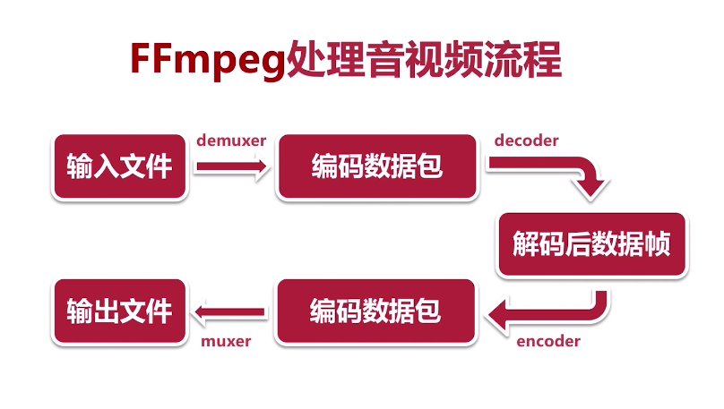

### FFmpeg处理音视频的流程

#### 输入文件/输出文件

一般都是一些已经封装的数据

MP4 , FLV   等等封装好的数据格式

#### Demuxer

解封装,我们需要把封装的数据解封装,用于后面的各种操作

#### 解码数据包

经过Demuxer的编码数据,此时的数据还是被编码过的

#### Decoder

解码,把封装的数据解码为原始数据,基本还原录制时的原始数据

#### 解码后数据

通过`Decoder`后的原始数据

#### Encoder

当我们拿到数据后就可以对原始数据做出各种操作,滤镜,裁剪等等操作

而后我们需要对这些原始数据做一个编码.

#### Muxer

我们的音视频数据经过编码后,不利于使用,传播

通过`编码数据包`对数据编码,形成一种可用的编码格式,用于播放传播扥等

例子

- MP4 -> FLV

解封装 -> Muxer即可

- MP4  1080p  ->  MP4 720p

解封装 ->  解码 -> 原始数据 -> 编码 -> 封装

