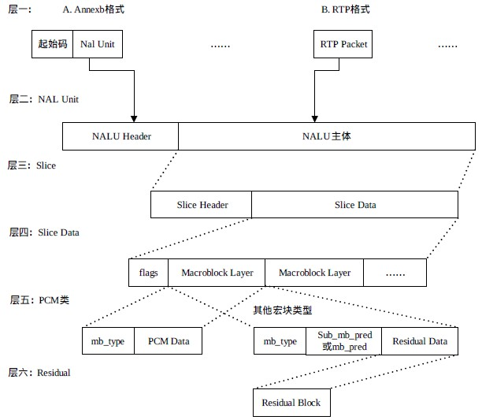
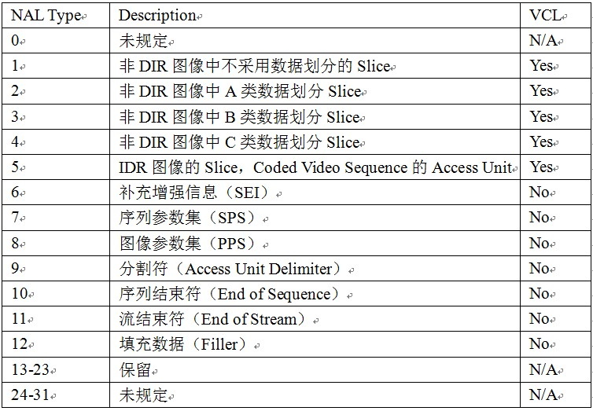

### 抽取(H.264)视频数据

#### Start Code 特征码
标识每一帧,为了把每一帧的数据都隔开

#### PPS/SPS  
> 解码的视屏参数,帧率等等都是存放在PPS/SPS中

- 对于文件来说,我们可能只需要一份PPS/SPS,读取完毕后就可以一直使用

- 对于网络等,我们就需要多份,参数有可能会变化

- 对于直播流来说,我们可能需要在每一关键帧前都放置PPS/SPS

#### Codec -> extradata
PPS/SPS在解码数据的额外信息数据中附带

#### H.264码流结构

##### Annexb格式

Annexb格式：NALU数据+起始码，如果 NALU 对应的 Slice 为一帧的开始,则用 4 字节表示,即 0x00000001；否则用 3 字节表示,0x000001。

##### RTP格式

NALU数据+RTP协议的RTP头数据。

##### NAL Header

forbidden_bit,nal_reference_bit(优先级),nal_unit_type(类型)。

##### 脱壳操作

为了使 NALU 主体不包括起始码,在编码时每遇到两个字节(连续)的0，就插入一字节 0x03，以和起始码相区别。解码时,则将相应的 0x03 删除掉。

#### NAL单元的类型

